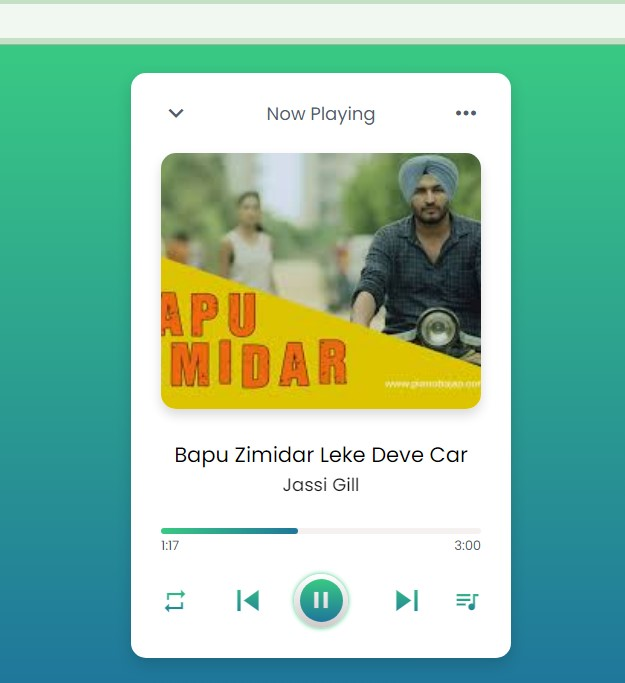

# 🎵 Music Player Web Application

Welcome to the Music Player web app! This modern and responsive music player brings the power of digital music streaming to your web browser, allowing users to manage, play, and control their favorite songs with a smooth and intuitive interface. Built with cutting-edge web technologies, this music player is designed for simplicity, elegance, and seamless usability across all devices.

## 🔑 Key Features

- **Responsive Design**: Enjoy a smooth experience on all devices—whether you're on a desktop, tablet, or mobile phone.
- **Comprehensive Controls**: Full-featured playback controls, including play/pause, next/previous, shuffle, loop, and seek.
- **Dynamic Playlist**: Displays a live playlist with song titles, artists, and album art, automatically updating as songs play.
- **Interactive Progress Bar**: Visual progress of the song with an option to seek to any part of the track.
- **Shuffle & Loop**: Play your songs in random order or repeat a song endlessly—at the touch of a button.
- **Album Art Display**: Visually appealing song artwork displayed during playback.
- **Real-Time Updates**: The interface updates in real-time as you interact with the player.

## 🚀 Demo

Check out the live demo here 👉: [Music Player Demo](https://12vishalkumar.github.io/CodeAlpha_MusicPlayer)

## 🛠️ Technologies Used

This project utilizes modern web technologies to deliver a high-quality, interactive music experience:

- **HTML5**: For structuring the layout and providing the music player controls.
- **CSS**: For stylish and responsive design, ensuring a fluid user experience across different devices.
- **JavaScript**: For handling playback functionality, user interactions, and dynamic playlist updates.

## 🎯 Purpose & Motivation

The Music Player web app is designed to offer users a powerful yet simple tool to manage and play music directly from their browser. Inspired by the growing demand for web-based media applications, this project delivers an easy-to-use interface with essential playback features that fit perfectly within the modern web ecosystem. Whether you're streaming music from your personal library or from online sources, this player provides an elegant and intuitive solution.

## 🧑‍💻 Usage Guide

- **Play Music**: Click on the "Play" button to start playback. The first song from the playlist will start playing.
- **Pause Music**: Click the "Pause" button to stop the song.
- **Next/Previous Track**: Use the skip buttons to navigate through the playlist.
- **Shuffle**: Enable shuffle mode to play songs in a random order.
- **Loop**: Toggle loop mode to repeat the current song or playlist.
  
The player updates in real-time, ensuring smooth transitions between tracks and dynamic feedback during playback.

## 🎨 Customization

This project is highly customizable for both design and functionality. You can:

- **Change Styles**: Modify the `style.css` file to alter the appearance, color scheme, and layout.
- **Add Songs**: Extend the playlist by adding more tracks to the `musicList.js` file. Simply add song paths, titles, and artist details.
- **Enhance Functionality**: Implement new features like a song search bar, playlist sorting, or a visual equalizer by modifying the `script.js` file.

## 📜 License

This project is licensed under the MIT License - see the [LICENSE](LICENSE) file for details.

## 🙏 Acknowledgements

Special thanks to:

- [Google Fonts](https://fonts.google.com/) for providing beautiful fonts.
- [FontAwesome](https://fontawesome.com/) for the icons used in this project.
- [Free Music Archive](https://freemusicarchive.org/) for providing royalty-free music tracks.
